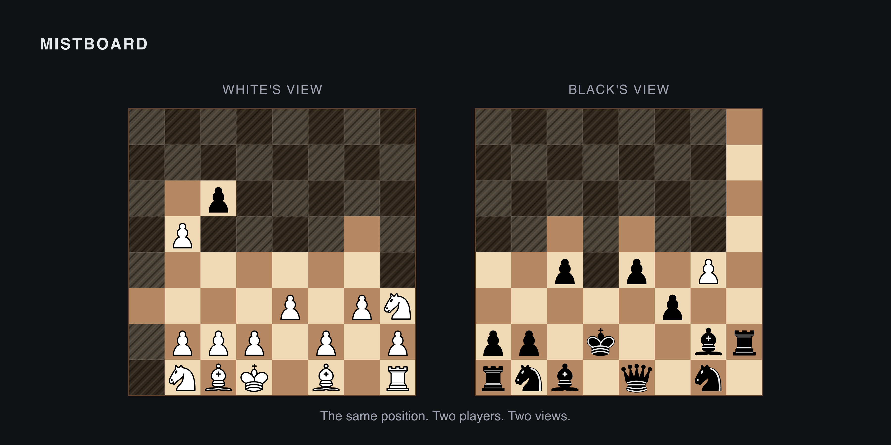

# [Mistboard](https://mistboard.com)

[](https://github.com/brianhliou/mistboard/actions/workflows/ci.yml)
[](LICENSE)



Mistboard is a free, open-source platform for **dark chess** — also called Fog
of War chess — a hidden-information variant where each player only sees what
their own pieces can legally see, [enforced by the server](https://mistboard.com/articles/server-enforced-fog).

The project is building a trustworthy foundation for hidden-information games,
starting with chess: server-authoritative play, a serious ranked ladder, and the
strongest open-source dark-chess engine people can play against and study.

It features low-friction [PvP rooms](https://mistboard.com), private
[Draft960](https://mistboard.com/articles/draft960) back-rank drafting,
post-game replay from either player's perspective or full truth, per-game Open
Graph share images, PGN/JSON export, [per-bucket Elo](https://mistboard.com/leaderboard),
and an in-house [engine track](https://mistboard.com/articles/engine-belief-state)
targeting a world-class open-source dark-chess engine.

Mistboard is written in [TypeScript](https://www.typescriptlang.org/) across a small npm workspace. The browser client is a no-framework [Vite](https://vitejs.dev/) build that uses [chessground](https://github.com/lichess-org/chessground) for board rendering and [chessops](https://github.com/niklasf/chessops) for chess primitives. The server is a [Node](https://nodejs.org/) WebSocket process that owns canonical game state, with [Postgres](https://www.postgresql.org/) for the event log and game history and [pino](https://github.com/pinojs/pino) for structured logs. A pure-game `packages/game` module holds the variant rules, visibility kernel, and the `getPlayerView()` boundary — the central abstraction that ensures no hidden truth ever reaches the wrong client. An offline [Python research lab](research/python-fow-lab) is used for visibility, belief, and bot experiments and is not part of the product. Hosted on [Railway](https://railway.com/). Analytics via [PostHog](https://posthog.com/).

Mistboard is an independent open-source project. It is not affiliated with lichess, chess.com, or any other chess platform.

Use [GitHub issues](https://github.com/brianhliou/mistboard/issues) for bug reports and feature requests.

## Status

Live PvP dark chess is playable at [mistboard.com](https://mistboard.com). The project is working toward [M1 pre-distribution gates](docs/ROADMAP.md) before wider outreach.

## Installation

```bash
npm install
npm run dev   # in-memory server, fastest for UI work
npm test
```

See [`CONTRIBUTING.md`](CONTRIBUTING.md) for dev rooms, local Postgres setup, and integration tests.

## Architecture

```text
packages/game           Pure game logic: types, rules, visibility, variants
packages/board-render   Shared SVG board renderer (server + browser)
apps/server             WebSocket rooms, clocks, event log, HTTP API
apps/web                Board UI, game screens, client WebSocket handling
research/python-fow-lab Offline Python research lab (not shipped)
```

See [`docs/ARCHITECTURE.md`](docs/ARCHITECTURE.md) for the full data flow and state model, and [`docs/rules.md`](docs/rules.md) for the dark chess / Fog of War rule baseline.

## Contributing

See [`CONTRIBUTING.md`](CONTRIBUTING.md), [`CODE_OF_CONDUCT.md`](CODE_OF_CONDUCT.md), and [`SECURITY.md`](SECURITY.md).

## License

AGPL-3.0-or-later. See [`LICENSE`](LICENSE).

For uses that require terms other than AGPL (e.g. closed-source distribution), reach out via [mistboard.com/contact](https://mistboard.com/contact).

## Governance

Mistboard is founder-led. The code is open source, but the official project identity, `mistboard.com`, hosted service, roadmap, and production infrastructure remain controlled project assets.

See [`GOVERNANCE.md`](GOVERNANCE.md), [`TRADEMARK.md`](TRADEMARK.md), and [`docs/project-direction.md`](docs/project-direction.md).
